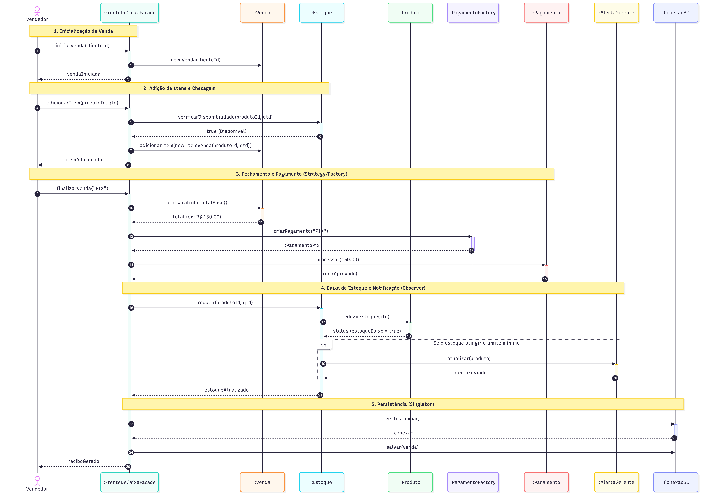
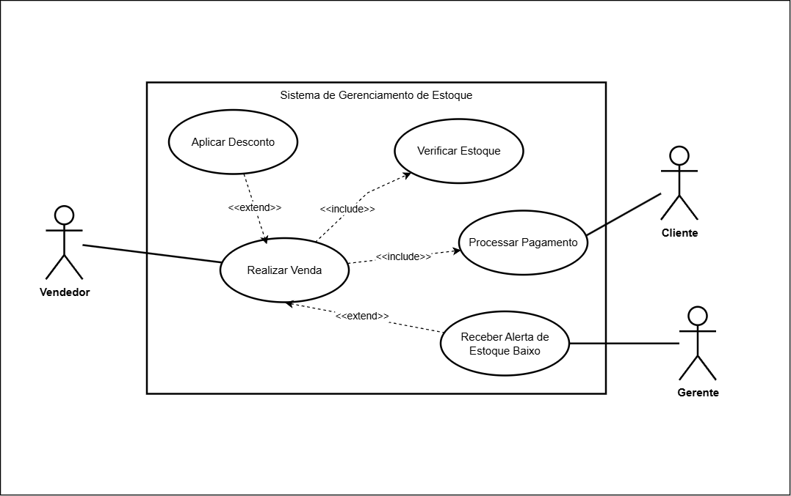

# 🛒 Frente de Caixa — Sistema de PDV e Controle de Estoque

O sistema simula uma frente de caixa real para pequenos comércios, permitindo gestão de vendas, controle de estoque, cadastro de produtos e clientes, relatórios de vendas e controle de acesso por perfil (Gerente/Vendedor).

---

## 📋 Índice

- [Funcionalidades](#-funcionalidades)
- [Tecnologias](#-tecnologias)
- [Estrutura do Projeto](#-estrutura-do-projeto)
- [Padrões de Projeto](#-padrões-de-projeto)
- [Modelagem UML](#-modelagem-uml)
- [Banco de Dados](#-banco-de-dados)
- [Como Executar](#-como-executar)
- [Usuários Padrão](#-usuários-padrão)
- [Equipe](#-equipe)

---

## ✨ Funcionalidades

- **PDV (Ponto de Venda):** Busca de produtos, carrinho de compras, cálculo automático de totais, aplicação de descontos e finalização de venda com PIX ou Cartão.
- **Cadastro de Produtos:** CRUD completo com vínculo a categorias.
- **Cadastro de Clientes:** CRUD completo com nome, CPF e e-mail.
- **Controle de Estoque:** Visualização de estoque, ajuste manual de quantidades e alertas automáticos para produtos com estoque baixo (≤ 5 unidades).
- **Relatórios de Vendas:** Filtro por período (hoje, 7 dias, 30 dias, personalizado) e por tipo de pagamento.
- **Controle de Acesso:** Gerente tem acesso total; vendedor/cliente tem acesso restrito e precisa de autorização de gerente para aplicar descontos.
- **Cálculo de Taxas:** PIX é isento de taxa; Cartão cobra 2.5% via Strategy Pattern.

---

## 🛠 Tecnologias

| Tecnologia | Versão | Finalidade |
|---|---|---|
| Java | 17+ | Linguagem principal |
| JavaFX | 17.0.6 | Interface gráfica (GUI) |
| FXML | — | Definição declarativa de telas |
| CSS | — | Estilização da interface |
| SQLite | 3.45.1 | Banco de dados relacional |
| JDBC | — | Conexão Java ↔ SQLite |
| Maven | 3.x | Gerenciamento de dependências e build |

---

## 📁 Estrutura do Projeto

```
frente-de-caixa/
├── pom.xml                          # Configuração Maven
├── iniciar.bat                      # Script de inicialização (Windows)
│
├── src/main/java/com/frentedecaixa/
│   ├── App.java                     # Classe principal (JavaFX Application)
│   │
│   ├── model/                       # Classes de domínio
│   │   ├── Usuario.java             # Classe abstrata base
│   │   ├── Cliente.java             # Herda de Usuario
│   │   ├── Gerente.java             # Herda de Usuario
│   │   ├── Produto.java             # Produto com estoque
│   │   ├── Categoria.java           # Categoria de produto
│   │   ├── Venda.java               # Venda com itens
│   │   ├── ItemVenda.java           # Item individual de uma venda
│   │   └── Pagamento.java           # Interface de pagamento
│   │
│   ├── dao/                         # Data Access Objects (CRUD)
│   │   ├── ClienteDAO.java
│   │   ├── GerenteDAO.java
│   │   ├── ProdutoDAO.java
│   │   ├── CategoriaDAO.java
│   │   ├── VendaDAO.java
│   │   └── ItemVendaDAO.java
│   │
│   ├── controller/                  # Controllers JavaFX
│   │   ├── LoginController.java
│   │   ├── PDVController.java
│   │   ├── ProdutoController.java
│   │   ├── ClienteController.java
│   │   ├── EstoqueController.java
│   │   └── RelatorioController.java
│   │
│   └── pattern/                     # Padrões de projeto
│       ├── singleton/
│       │   └── ConexaoBD.java       # Singleton — conexão única com BD
│       ├── factory/
│       │   ├── PagamentoFactory.java # Factory — criação de pagamentos
│       │   ├── PagamentoPix.java
│       │   └── PagamentoCartao.java
│       ├── facade/
│       │   └── FrenteDeCaixaFacade.java # Facade — interface simplificada
│       ├── decorator/
│       │   └── DescontoDecorator.java   # Decorator — desconto dinâmico
│       ├── observer/
│       │   ├── Observer.java         # Interface Observer
│       │   ├── Estoque.java          # Subject — monitora estoque
│       │   └── AlertaGerente.java    # Observer — notifica gerente
│       └── strategy/
│           ├── EstrategiaCalculoTaxa.java # Interface Strategy
│           ├── TaxaCartaoStrategy.java    # Taxa de 2.5% para cartão
│           └── IsencaoPixStrategy.java    # Isenção de taxa para PIX
│
├── src/main/resources/
│   ├── com/frentedecaixa/view/      # Telas FXML
│   │   ├── login.fxml
│   │   ├── pdv.fxml
│   │   ├── produtos.fxml
│   │   ├── clientes.fxml
│   │   ├── estoque.fxml
│   │   └── relatorios.fxml
│   ├── db/
│   │   └── schema.sql               # Schema do banco de dados
│   └── styles/
│       └── app.css                  # Estilização CSS
│
└── diagramas/                       # Diagramas UML
    ├── diagrama-classes.png
    ├── diagrama-sequencia.png
    └── diagrama-casos-uso.png
```

---

## 🎨 Padrões de Projeto

O sistema implementa **6 padrões de projeto**, com pelo menos 1 de cada categoria (criacional, estrutural e comportamental):

### Criacionais

#### 1. Singleton — `ConexaoBD`
**Problema:** Garantir uma única conexão ativa com o banco SQLite durante toda a execução.  
**Solução:** Construtor privado + método estático `getInstancia()` sincronizado que retorna sempre a mesma instância.  
**Benefício:** Economia de recursos e ponto centralizado de acesso ao banco.  
**Classes:** `ConexaoBD`

#### 2. Factory Method — `PagamentoFactory`
**Problema:** Criar objetos de pagamento (PIX ou Cartão) sem expor a lógica de instanciação ao restante do sistema.  
**Solução:** Método estático `criarPagamento(String tipo)` que retorna a implementação adequada da interface `Pagamento`.  
**Benefício:** Facilita a adição de novos tipos de pagamento sem alterar código existente (Princípio Aberto/Fechado).  
**Classes:** `PagamentoFactory`, `PagamentoPix`, `PagamentoCartao`, `Pagamento` (interface)

### Estruturais

#### 3. Facade — `FrenteDeCaixaFacade`
**Problema:** Os controllers da interface gráfica não devem conhecer a complexidade interna (DAOs, Observer, Factory, Decorator).  
**Solução:** Classe `FrenteDeCaixaFacade` expõe métodos simples (`iniciarVenda`, `adicionarItem`, `finalizarVenda`) que internamente orquestram todos os subsistemas.  
**Benefício:** Reduz acoplamento entre interface e lógica de negócio; simplifica o uso do sistema.  
**Classes:** `FrenteDeCaixaFacade`

#### 4. Decorator — `DescontoDecorator`
**Problema:** Aplicar descontos a vendas de forma flexível, sem alterar a classe `Venda`.  
**Solução:** `DescontoDecorator` estende `Venda`, recebe a venda original no construtor e sobrescreve `calcularTotalBase()` para aplicar o percentual de desconto.  
**Benefício:** Comportamento adicionado dinamicamente sem modificar classes existentes; permite empilhar decoradores futuramente.  
**Classes:** `DescontoDecorator`, `Venda`

### Comportamentais

#### 5. Observer — `Estoque` + `AlertaGerente`
**Problema:** Notificar automaticamente o gerente quando o estoque de um produto cai abaixo de 5 unidades, sem acoplar o módulo de vendas ao de alertas.  
**Solução:** `Estoque` é o Subject que mantém uma lista de Observers. Quando o estoque é reduzido e atinge o limiar, chama `notificar()`. `AlertaGerente` implementa a interface `Observer` e registra os alertas.  
**Benefício:** Desacoplamento total; novos observers podem ser adicionados sem alterar o Estoque.  
**Classes:** `Estoque` (Subject), `AlertaGerente` (Observer concreto), `Observer` (interface)

#### 6. Strategy — `EstrategiaCalculoTaxa`
**Problema:** Diferentes formas de pagamento possuem regras de taxa distintas (PIX isento, Cartão 2.5%). A lógica deve ser intercambiável.  
**Solução:** Interface `EstrategiaCalculoTaxa` com método `calcularTaxa(double valor)`. Cada forma de pagamento recebe sua strategy concreta (`TaxaCartaoStrategy` ou `IsencaoPixStrategy`).  
**Benefício:** Algoritmo de taxa pode ser trocado independentemente; elimina condicionais espalhados.  
**Classes:** `EstrategiaCalculoTaxa` (interface), `TaxaCartaoStrategy`, `IsencaoPixStrategy`

---

## 📐 Modelagem UML

O projeto contempla 3 diagramas UML:

### Diagrama de Classes
Mostra todas as classes do sistema com seus atributos, métodos e relacionamentos. Os estereótipos dos padrões de projeto estão explicitamente representados (`<<Singleton>>`, `<<Factory>>`, `<<Facade>>`, `<<Decorator>>`, `<<Observer>>`, `<<Strategy>>`).


### Diagrama de Sequência
Representa o fluxo completo de uma venda com pagamento PIX, dividido em 5 fases:
1. Inicialização da Venda
2. Adição de Itens e Checagem de Estoque
3. Fechamento e Pagamento (Strategy/Factory)
4. Baixa de Estoque e Notificação (Observer)
5. Persistência (Singleton)



### Diagrama de Casos de Uso
Apresenta os atores (Vendedor e Gerente) e os principais casos de uso do sistema.



---

## 🗃 Banco de Dados

O sistema utiliza **SQLite** como SGBD relacional. O banco é criado automaticamente na primeira execução e populado com dados iniciais.

### Tabelas

| Tabela | Descrição |
|---|---|
| `categoria` | Categorias de produtos (Alimentos, Bebidas, Limpeza, Higiene, Eletrônicos) |
| `usuario` | Usuários do sistema com tipo CLIENTE ou GERENTE |
| `produto` | Produtos com preço, estoque e vínculo a categoria |
| `venda` | Registro de vendas com data, cliente, pagamento, desconto e total |
| `item_venda` | Itens de cada venda (produto, quantidade, preço unitário) |

### Modelo Relacional

```
categoria (id PK, descricao UNIQUE)
usuario (id PK, nome, cpf UNIQUE, email, tipo, data_cadastro, nivel_acesso)
produto (id PK, nome UNIQUE, preco, qtd_estoque, categoria_id FK→categoria)
venda (id PK, data, cliente_id FK→usuario, tipo_pagamento, desconto, total)
item_venda (id PK, venda_id FK→venda, produto_id FK→produto, quantidade, preco_unitario)
```

### Características
- Chaves estrangeiras habilitadas via `PRAGMA foreign_keys = ON`
- Transações com `commit`/`rollback` na inserção de vendas (garante consistência entre venda e itens)
- Schema inicializado automaticamente via `schema.sql` na primeira execução
- Dados iniciais pré-cadastrados (categorias, gerente padrão, cliente padrão e 6 produtos)

---

## 🚀 Como Executar

### Pré-requisitos
- **Java JDK 17+** instalado
- **Apache Maven 3.x** instalado

### Opção 1: Via Maven (recomendado)
```bash
# Clone o repositório
git clone https://github.com/SEU_USUARIO/frente-de-caixa.git
cd frente-de-caixa

# Execute o sistema
mvn javafx:run
```

### Opção 2: Via script (Windows)
```bash
# Dê duplo clique no arquivo:
iniciar.bat
```

O script detecta automaticamente o Java e o Maven instalados no sistema.

### Observações
- O banco de dados `frentedecaixa.db` é criado automaticamente na raiz do projeto na primeira execução.
- Para resetar os dados, basta deletar o arquivo `frentedecaixa.db` e executar novamente.

---

## 👤 Usuários Padrão

O sistema já vem com dados iniciais para testes:

| Perfil | Nome | CPF | Permissões |
|---|---|---|---|
| Gerente | Admin Gerente | `00000000000` | Acesso total + autorizar descontos |
| Cliente | Cliente Padrão | `11111111111` | PDV com acesso restrito |

---

## 👥 Equipe

| Nome |
|---|
| Fabrício Elízio |
| Amaro Luna |
| Bruno Macedo |
| André Lucas |

---

## 📄 Licença

Projeto acadêmico desenvolvido para a disciplina de Análise e Projeto de Sistemas — UFCA, 2026.
